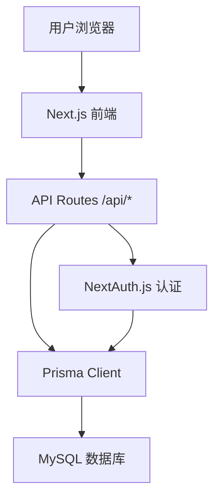

# 论坛网站架构规划

## 系统概述
这是一个基于Next.js的全栈论坛网站，使用MySQL数据库存储数据，支持用户发帖、评论、点赞等功能。

## 技术栈
- 前端：Next.js 16 + React 19 + TypeScript + Tailwind CSS
- 后端：Next.js API Routes
- 数据库：MySQL + Prisma ORM
- 认证：NextAuth.js
- Markdown：react-markdown + @uiw/react-md-editor

## 数据库模型
- User: id, email, password, name, role (user/admin), banned (boolean), avatar (string, nullable), bio (string, nullable)
- Post: id, content (markdown), authorId, createdAt, updatedAt
- Comment: id, content, postId, authorId, parentId (nullable, for replies), createdAt
- Like: id, targetType (post/comment), targetId, userId
- Repost: id, postId, userId (分享链接)

## 主要功能模块
1. 用户认证：注册、登录、角色管理，注册后完善基础信息和头像
2. 帖子管理：发布、编辑、删除（管理员可删所有）
3. 评论系统：添加、编辑、删除评论，支持回复功能
4. 互动：点赞（帖子、评论、回复）、转发（链接分享）
5. 管理员面板：管理帖子、禁止用户

## 架构图

## 页面结构
- / : 首页 - 帖子列表
- /post/[id] : 帖子详情页
- /profile : 个人信息页
- /user/[id] : 他用户信息页
- /admin : 管理员面板（仅管理员可见）

## 开发计划
见 todo.md

此文件已是旧文件