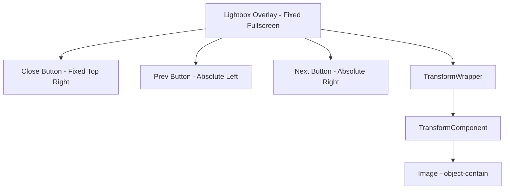

# Image Zoom & Navigation Implementation Plan

## Objective
Implement smooth zoom functionality and image navigation in the image lightbox within `PostImages.tsx`.

## Selected Approach
- **Zoom**: Use **`react-zoom-pan-pinch`** for gesture, pinch, and wheel zoom.
- **Navigation**: Custom state management in `PostImages.tsx` to switch between images in the array.

## Implementation Steps

### 1. Dependency
- Install: `npm install react-zoom-pan-pinch`

### 2. State & Logic Updates
- Change `selectedImage` (string | null) to `selectedIndex` (number | null) to easily navigate.
- Derived state: `currentImageUrl = selectedIndex !== null ? images[selectedIndex] : null`.
- Functions: `handleNext`, `handlePrev` with bounds checking.

### 3. UI Components (Lightbox)
- **Zoom Wrapper**: Wrap image in `TransformWrapper` and `TransformComponent`.
- **Navigation Buttons**:
    - "Previous" button on the left center.
    - "Next" button on the right center.
    - Only show if `images.length > 1`.
- **Close Button**: Top right, fixed.
- **Z-Index Management**: Ensure navigation and close buttons are above the zoomable area.

### 4. Behavior
- Switching images should **reset zoom** to 1.0.
- Clicking the background (outside navigation buttons) should close the lightbox.
- Support keyboard arrows (Left/Right) and Escape key.

## UI Layout (Mermaid)

## Todo List

- [ ] Install dependency: `npm install react-zoom-pan-pinch`
- [ ] Update `PostImages.tsx` state to use `selectedIndex` instead of `selectedImage`
- [ ] Implement `handleNext` and `handlePrev` logic
- [ ] Implement Zoom functionality
    - [ ] Wrap image with `TransformWrapper` and `TransformComponent`
    - [ ] Reset zoom when `selectedIndex` changes
- [ ] Add Navigation UI
    - [ ] Create Left/Right arrow buttons
    - [ ] Add keyboard listeners (ArrowLeft, ArrowRight, Escape)
- [ ] Refine Styling
    - [ ] Ensure buttons are visible on various image backgrounds
    - [ ] Ensure `TransformComponent` takes full available space
- [ ] Verification
    - [ ] Test zoom & pan
    - [ ] Test navigation (Next/Prev)
    - [ ] Test zoom reset on navigation
    - [ ] Test mobile responsiveness
